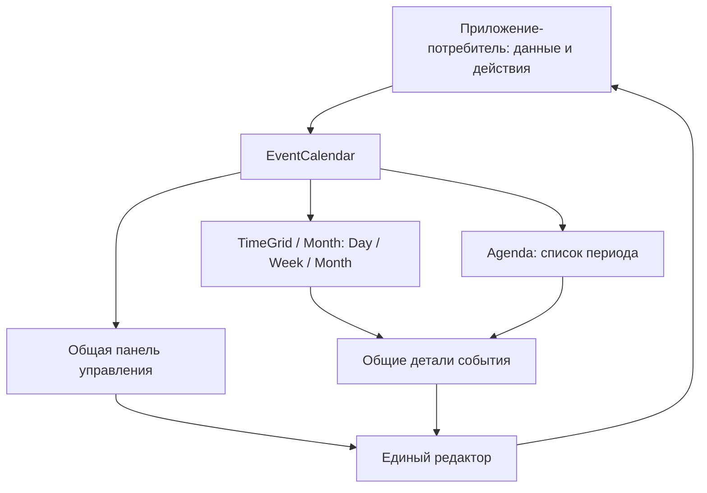

# FrontX Event Calendar

Предложение от 5 октября 2026. Локальный прототип переиспользуемого компонента реализован по прямому запросу Дениса. Сроки, платформенная интеграция и одобрение участников обсуждения не заявляются.

[Полная спецификация: состояния, примитивы, модель и источники](DESIGN-2026-10-05.md).

[План реализации и распределение работы](IMPLEMENTATION-PLAN.md) · [Матрица приёмки](ACCEPTANCE.md).

## Предлагаемый первый объём

| Что | Решение |
| --- | --- |
| Представления | **Day · Week · Month · Year**; список автоматически используется в узком контейнере |
| Плотность | **Standard · Compact**, независимо от представления и размера |
| Основные действия | Создать кнопкой или свободным слотом, открыть, редактировать |
| Событие | Название, начало/окончание, зона, весь день, описание, цвет |
| Данные | Синтетические, локальные; потребитель позже подключает свои данные |
| Совместимость | Существующие FrontX-примитивы, пять палитр, light/dark |
| Дополнение для ревью | Локальное удаление с подтверждением |

**Компактность:** сохраняем читаемый текст и доступные действия; сокращаем вторичную информацию и отступы. Для узкого блока предлагаем список, а не уменьшенную недельную сетку. Дату и выбранное событие сохраняем между видами.

**Навигация Showcase:** Components (Charts & widgets, Calendar, Elements) · Examples (Compositions, Sizing & density) · Foundations (Themes, Developer handoff). Старые ссылки сохраняются. Это предложение для существующего сайта, не новый проект.

**Позже:** повторения, приглашения/RSVP, вложения, drag/resize, бронирование ресурсов и синхронизация. Их наличие в чужих календарях не делает их обязательными для базового компонента.

Изучены shadcn, FullCalendar, Schedule-X и MUI X Scheduler. Главный вывод: date picker и календарь событий имеют разные задачи; существующий FrontX Calendar сохраняет свою роль выбора даты. Выбран FullCalendar 6.1.21 под оформлением FrontX; [основание и версии](ENGINE-DECISION.md).

Следующий checkpoint с Виталием Пантелеевым, Денисом Турановичем и Николой: обсудить эту границу компонента и сопоставить с конкретным календарём платформы. Его экран/API и принимающий итоговое решение пока не установлены.

Локальное ревью: `http://127.0.0.1:5202/?page=event-calendar`. Вкладки Playground / Embedded / React & contract. Навигация изменена только в рабочем локальном исходнике. Публичный сайт не менялся. Проверки и ограничения — в [QA record](../../qa/event-calendar/REPORT.md).

## Уточнение дизайна по обратной связи Дениса

[Визуальная итерация](VISUAL-REFRESH.md): цветные события, выбор цвета, общий переключатель Day / Week / Month / Year. Preview показывает три живые композиции — большой календарь, Compact 360×360 и Month 640×640. Playground отдельно содержит FrontX Select для размера, плотности, зоны и состояний. Проверки первой версии находятся в `qa/event-calendar/`; актуальная проверка этой итерации — `qa/calendar-refresh/`.
